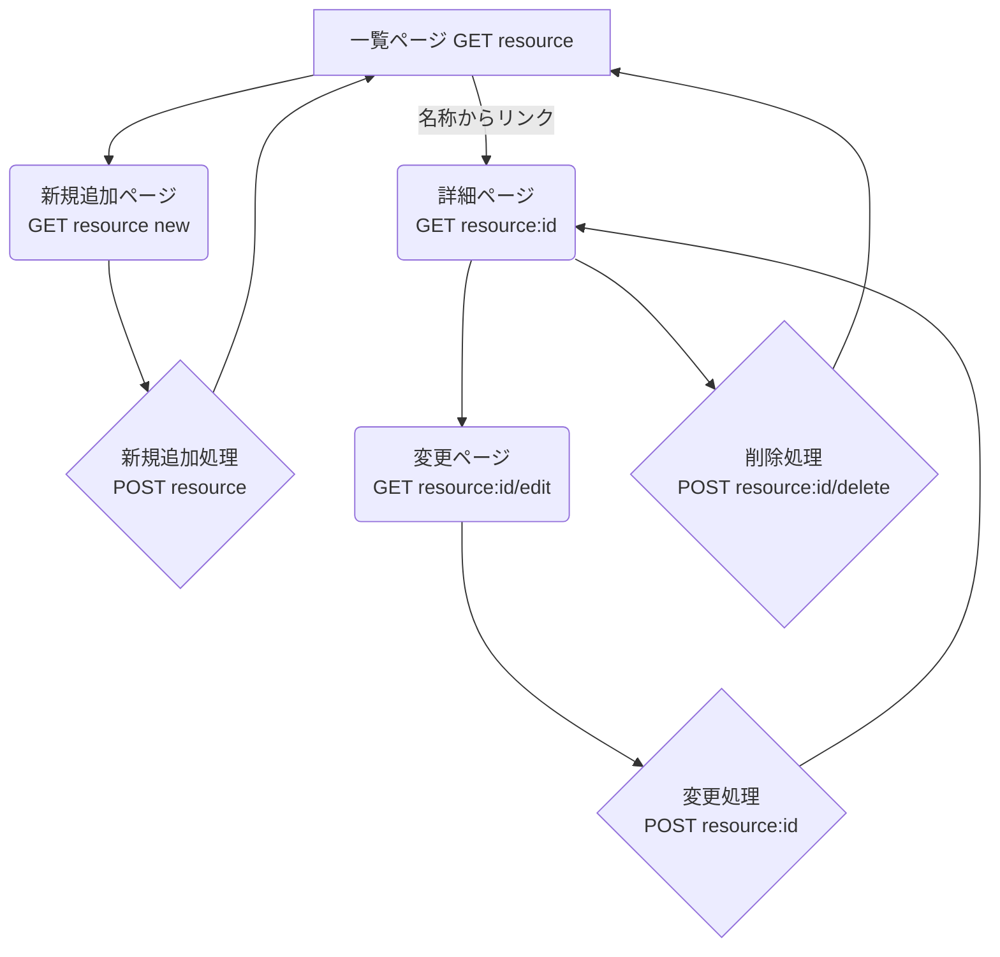

# Webアプリケーション設計書 (一覧表示ベース)

本仕様書は，JavaScript（Node.js/Express）を用いて開発する3つのWebアプリケーション（都道府県，元素記号，88星座）の基本設計を定義する．

## 1. 共通要件

すべてのアプリケーションは，以下の共通要件に基づき設計される．

* **機能**: データの一覧表示，詳細表示，新規追加，変更，削除 (CRUD) を実装する．
* **データストア**: データは永続化せず，サーバーのメモリ（変数）内に配列として保持する．サーバーを再起動するとデータはリセットされる．
* **技術スタック（想定）**: Node.js, Express, EJS
* **ルーティング**: リソース（都道府県，元素，星座）に基づいたRESTfulなルーティングを採用する．

## 2. 共通のページ遷移と機能設計

3つのアプリケーションはすべて共通のページ遷移パターンを持つ．
以下では，リソース名を `{resource}`（例: `prefectures`, `elements`, `constellations`）として汎用的に記述する．

### ページとルーティング

| HTTPメソッド | URL | 説明 | ページ |
| :--- | :--- | :--- | :--- |
| GET | `/{resource}` | 一覧表示 | 一覧ページ |
| GET | `/{resource}/new` | 新規追加フォーム表示 | 新規追加ページ |
| POST | `/{resource}` | 新規データ追加処理 | (処理後，一覧へリダイレクト) |
| GET | `/{resource}/:id` | 詳細表示 | 詳細ページ |
| GET | `/{resource}/:id/edit` | 変更フォーム表示 | 変更ページ |
| POST | `/{resource}/:id` | データ変更処理 (※1) | (処理後，詳細へリダイレクト) |
| POST | `/{resource}/:id/delete` | データ削除処理 (※2) | (処理後，一覧へリダイレクト) |

※1: HTMLフォームはPUT/PATCHを直接サポートしないため，`method-override`ライブラリ等でPOSTを偽装するか，`POST /{resource}/:id/update` のようなURLで実装する．ここでは `POST /{resource}/:id` を「更新」として扱う．
※2: 同様に，`method-override`でDELETEを偽装するか，`POST`で処理する．

### ページ遷移フローチャート (Mermaid)

### Mermaid

すでに授業で紹介している，Mermaidによる図も使用できる．
簡単な図しか描画できないが編集が簡単なので，設計・検討段階に下書きツールとして使用すると良い．
