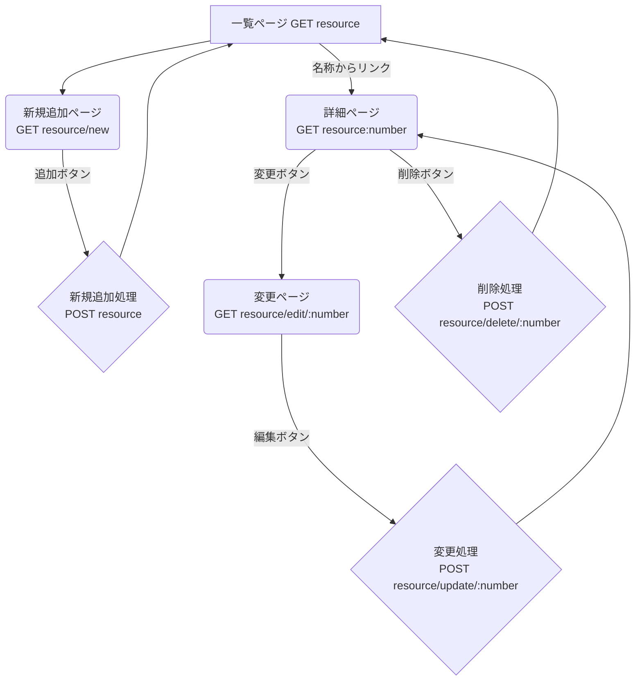

# Webアプリケーション設計書 (仮)

本仕様書は，JavaScript（Node.js/Express）を用いて開発する3つのWebアプリケーション（都道府県，元素記号，88星座）の基本設計を定義する．

## 1. 共通要件

すべてのアプリケーションは，以下の共通要件に基づき設計される．

* **機能**: データの一覧表示，詳細表示，新規追加，変更，削除 を実装する．
* **データ**: データは永続化せず，サーバーのメモリ（変数）内に配列として保持する．サーバーを再起動するとデータはリセットされる．

## 2. データ構造

Webアプリケーションが持つデータ構造について説明する．
以下の表に，都道府県におけるデータ構造の例を示す．

| 名前 | 内容 | 例(都道府県) |
| :--- | :--- | :--- |
| id | データの識別子 | 都道府県番号 |
| name | データの名称 | 都道府県の名前 |
| type | データの種類 | 地方名 |
| size_1 | データの数量1 | 都道府県の人口 |
| size_2 | データの数量2 | 都道府県の面積 |

## 3. 共通のページ遷移と機能設計

3つのアプリケーションはすべて共通のページ遷移パターンを持つ．
以下では，リソース名を `{resource}`（例: `prefectures`, `elements`, `constellations`）として汎用的に記述する．

### ページとルーティング

| HTTPメソッド | URL | 説明 | ページ |
| :--- | :--- | :--- | :--- |
| GET | `/{resource}` | 一覧表示 | 一覧ページ |
| GET | `/{resource}/new` | 新規追加フォーム表示 | 新規追加ページ |
| POST | `/{resource}` | 新規データ追加処理 | (処理後，一覧へリダイレクト) |
| GET | `/{resource}/:number` | 詳細表示 | 詳細ページ |
| GET | `/{resource}/edit/:number` | 変更フォーム表示 | 変更ページ |
| POST | `/{resource}/update/:number` | データ変更処理 | (処理後，詳細へリダイレクト) |
| POST | `/{resource}/delete/:number` | データ削除処理 | (処理後，一覧へリダイレクト) |

また，以下の図にページ遷移フローチャートを示す．

### ページ遷移フローチャート (Mermaid)

