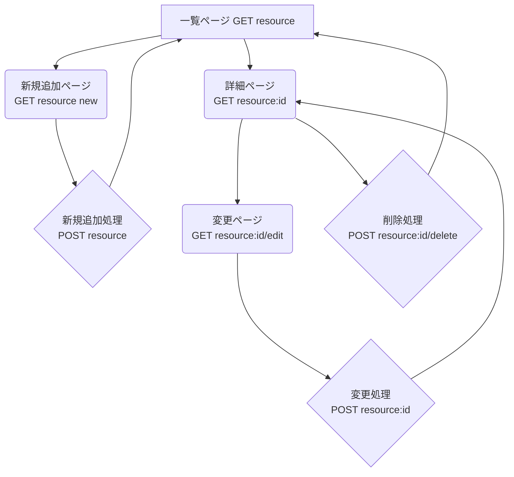
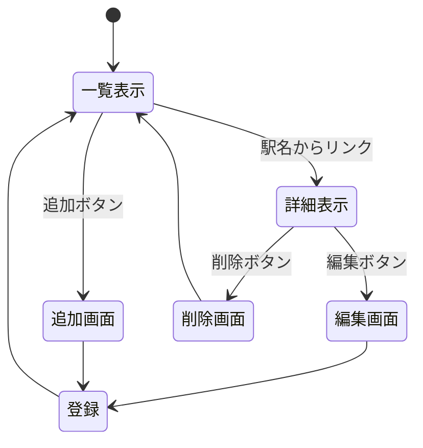

# Webアプリケーション設計書 (一覧表示ベース)

本ドキュメントは、JavaScript（Node.js/Express）を用いて開発する3つのWebアプリケーション（都道府県、元素記号、88星座）の基本設計を定義します。

## 1. 共通要件

すべてのアプリケーションは、以下の共通要件に基づき設計されます。

* **機能**: データの一覧表示、詳細表示、新規追加、変更、削除 (CRUD) を実装します。
* **データストア**: データは永続化せず、サーバーのメモリ（変数）内に配列として保持します。サーバーを再起動するとデータはリセットされます。
* **技術スタック（想定）**: Node.js, Express, EJS
* **ルーティング**: リソース（都道府県、元素、星座）に基づいたRESTfulなルーティングを採用します。

## 2. 共通のページ遷移と機能設計

3つのアプリケーションはすべて共通のページ遷移パターンを持ちます。
以下では、リソース名を `{resource}`（例: `prefectures`, `elements`, `constellations`）として汎用的に記述します。

### ページとルーティング

| HTTPメソッド | URL | 説明 | ページ |
| :--- | :--- | :--- | :--- |
| GET | `/{resource}` | 一覧表示 | 一覧ページ |
| GET | `/{resource}/new` | 新規追加フォーム表示 | 新規追加ページ |
| POST | `/{resource}` | 新規データ追加処理 | (処理後、一覧へリダイレクト) |
| GET | `/{resource}/:id` | 詳細表示 | 詳細ページ |
| GET | `/{resource}/:id/edit` | 変更フォーム表示 | 変更ページ |
| POST | `/{resource}/:id` | データ変更処理 (※1) | (処理後、詳細へリダイレクト) |
| POST | `/{resource}/:id/delete` | データ削除処理 (※2) | (処理後、一覧へリダイレクト) |

※1: HTMLフォームはPUT/PATCHを直接サポートしないため、`method-override`ライブラリ等でPOSTを偽装するか、`POST /{resource}/:id/update` のようなURLで実装します。ここでは `POST /{resource}/:id` を「更新」として扱います。
※2: 同様に、`method-override`でDELETEを偽装するか、`POST`で処理します。

### ページ遷移フローチャート (Mermaid)

### タスクリスト

行う作業を整理するために，タスクリストを作成できる．
詳しいことはこのページのソースコードを参照すること．

- [ ] 開発者向けドキュメントの作業
  - [x] 対象とするシステムの決定 :thinking:
  - [ ] データ構造の決定 :thinking:
  - [ ] ページ構造の検討 :thinking:
  - [ ] ページ遷移の検討 :thinking:
  - [ ] HTTPメソッドとリソース名の決定
  - [ ] ページ遷移図の作成 :writing_hand:
  - [ ] ページ構造の決定
  - [ ] ドキュメントの構成の検討 :thinking:
  - [ ] 概要 :writing_hand:
  - [ ] HTTPメソッドとリソース名一覧 :writing_hand:
  - [ ] データ構造 :writing_hand:
  - [ ] リソース名ごとの機能の詳細 :writing_hand:
- [ ] 管理者向けドキュメントの構成
  - [ ] インストールから起動までの手順確認 :computer:
  - [ ] インストール方法 :writing_hand:
  - [ ] 起動方法 :writing_hand:
  - [ ] 起動できない場合 :writing_hand:
  - [ ] 終了方法 :writing_hand:
  - [ ] 分かっている不具合 :writing_hand:
- [ ] 利用者向けドキュメントの作業
  - [ ] 構成の検討 :thinking:
  - [ ] スクリーンショットの保存と整理 :computer:
  - [ ] 概要 :writing_hand:
  - [ ] 使用できる機能 :writing_hand:
  - [ ] 起動画面 :writing_hand:
  - [ ] 一覧表示 :writing_hand:
  - [ ] 詳細表示 :writing_hand:
  - [ ] データ追加 :writing_hand:
  - [ ] データ削除 :writing_hand:
  - [ ] データ編集 :writing_hand:
- [ ] 提出 :tada:

### Mermaid

すでに授業で紹介している，Mermaidによる図も使用できる．
簡単な図しか描画できないが編集が簡単なので，設計・検討段階に下書きツールとして使用すると良い．

